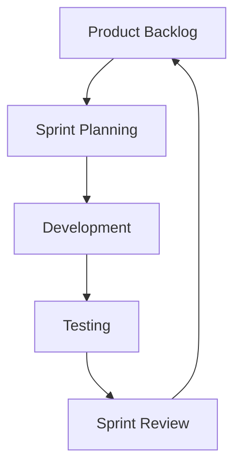
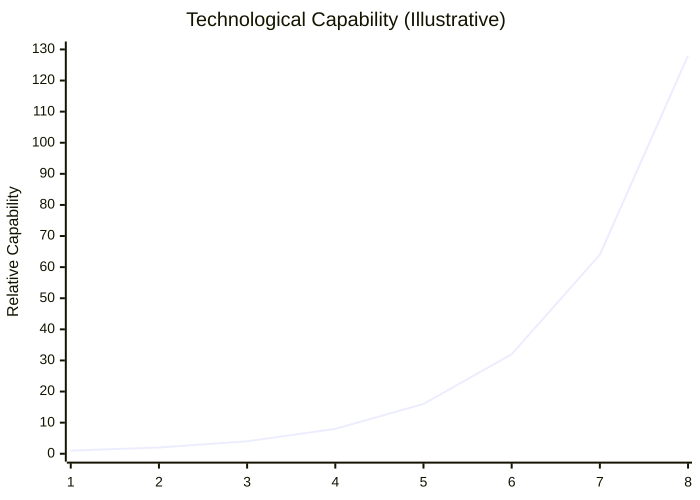
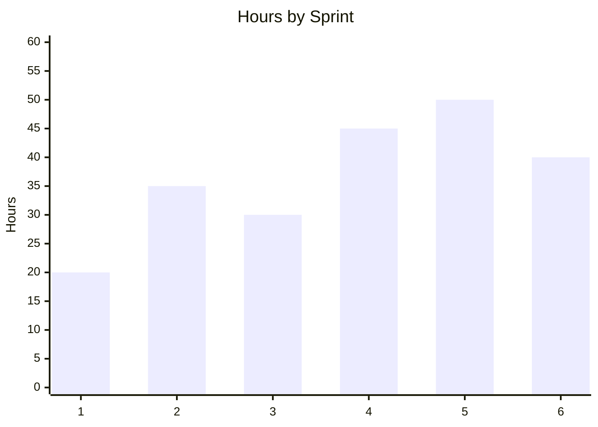
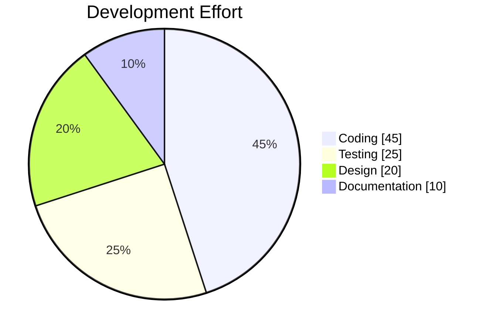
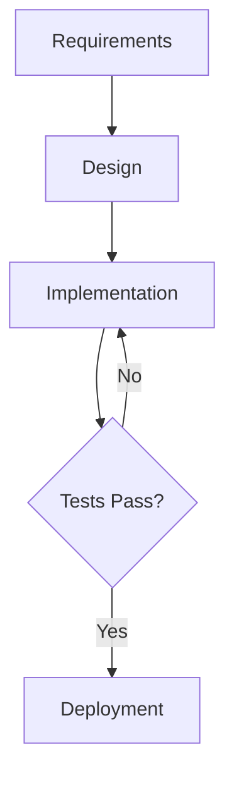
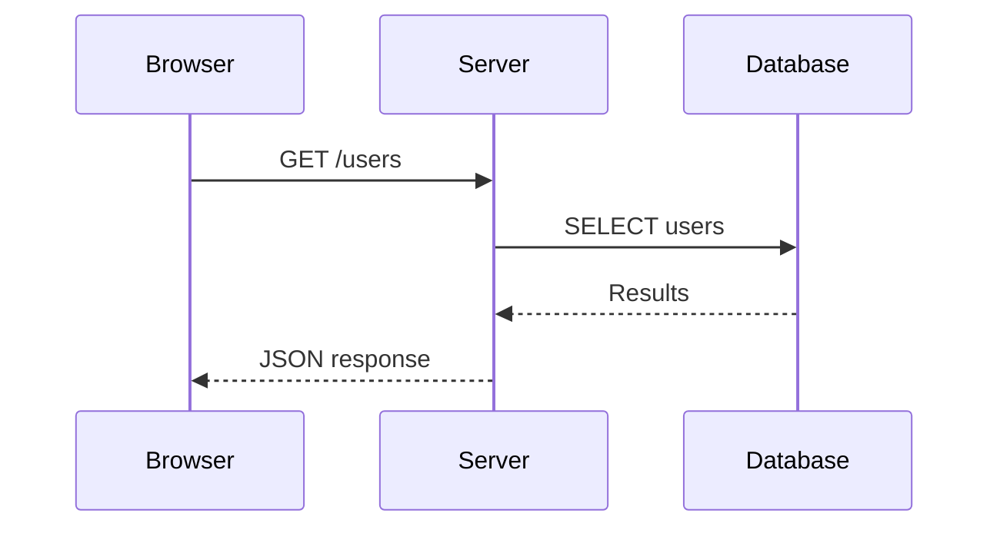
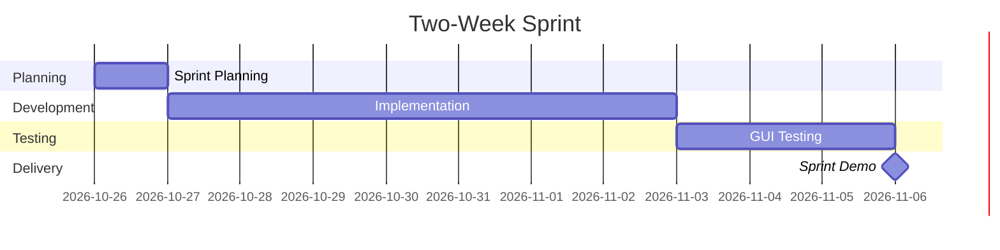
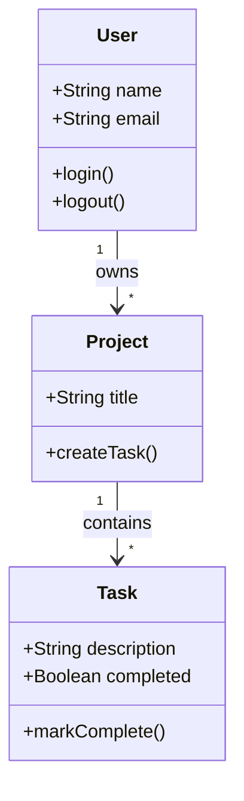
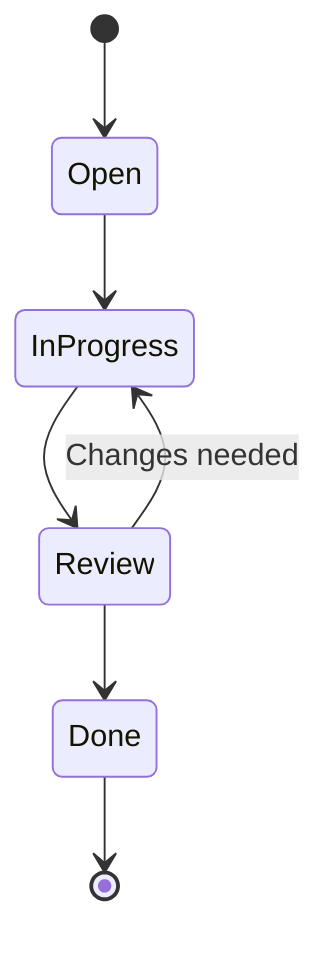
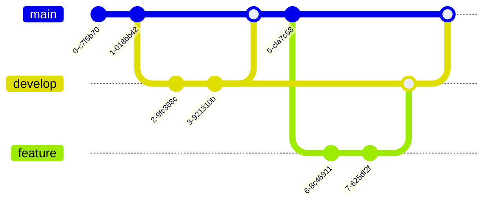

# markdowntest

```mermaid

flowchart TD
    A[Product Backlog] --> B[Sprint Planning]
    B --> C[Development]
    C --> D[Testing]
    D --> E[Sprint Review]
    E --> A
```
## Line Chart

```mermaid
xychart-beta
    title "Technological Capability (Illustrative)"
    x-axis [1, 2, 3, 4, 5, 6, 7, 8]
    y-axis "Relative Capability" 0 --> 130
    line [1, 2, 4, 8, 16, 32, 64, 128]
```
## Bar Chart

```mermaid
xychart-beta
    title "Hours by Sprint"
    x-axis [1, 2, 3, 4, 5, 6]
    y-axis "Hours" 0 --> 60
    bar [20, 35, 30, 45, 50, 40]
```
## Pie Chart

```mermaid
pie showData
    title Development Effort
    "Coding" : 45
    "Testing" : 25
    "Design" : 20
    "Documentation" : 10
```
## Flowchart

```mermaid
flowchart TD
    A[Requirements] --> B[Design]
    B --> C[Implementation]
    C --> D{Tests Pass?}
    D -->|Yes| E[Deployment]
    D -->|No| C
```
## Sequence Diagram

```mermaid
sequenceDiagram
    participant B as Browser
    participant S as Server
    participant DB as Database
    B->>S: GET /users
    S->>DB: SELECT users
    DB-->>S: Results
    S-->>B: JSON response
```
## Gantt Chart

```mermaid
gantt
    title Two-Week Sprint
    dateFormat YYYY-MM-DD
    section Planning
    Sprint Planning :a1, 2026-10-26, 1d
    section Development
    Implementation :a2, after a1, 7d
    section Testing
    GUI Testing :a3, 2026-11-03, 3d
    section Delivery
    Sprint Demo :milestone, 2026-11-06, 0d
```
## Class Diagram

```mermaid
classDiagram
    class User {
        +String name
        +String email
        +login()
        +logout()
    }
    class Project {
        +String title
        +createTask()
    }
    class Task {
        +String description
        +Boolean completed
        +markComplete()
    }
    User "1" --> "*" Project : owns
    Project "1" --> "*" Task : contains
```
## State Diagram

```mermaid
stateDiagram-v2
    [*] --> Open
    Open --> InProgress
    InProgress --> Review
    Review --> Done
    Review --> InProgress : Changes needed
    Done --> [*]
```

## Git Sequence Diagram

```mermaid
gitGraph
		commit
		commit
		branch develop
		checkout develop
		commit
		commit
		checkout main
		merge develop
		commit
		branch feature
		checkout feature
		commit
		commit
		checkout develop
		merge feature
		checkout main
		merge develop
```
